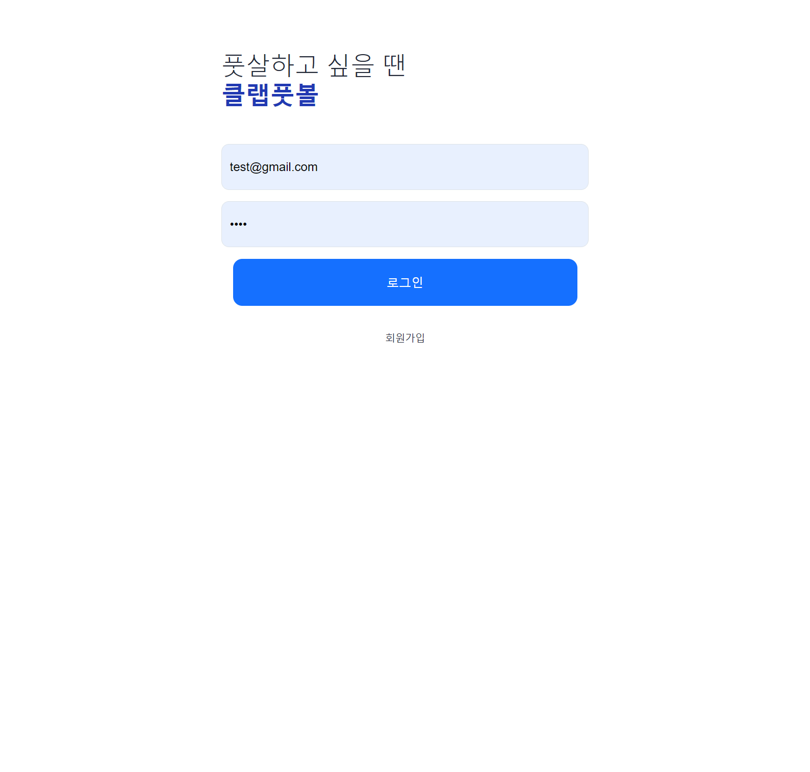

# Clap Football (front)

 
평소 즐겨 이용하던 __[플랩풋볼](https://www.plabfootball.com/)__ 의 메인 페이지의 경기장 목록과 상세 페이지를 클론코딩 하였습니다.
프로젝트 후기는 __[블로그](https://quokkas.tistory.com/entry/Clap-Football-Frontend-Review)__ 에서 읽으실 수 있습니다.

2022.9 ~ 2022.12 동안  React framework 입문 인강을 수강하고 퇴근 후 / 주말 일정 없을 때 작업하였으며 아래 페이지를 구현하였습니다.

(1) 메인 매치 리스트  
경기 신청 가능한 인원이 채워지면 마감으로 표시되고 마감인원-3명 부터 마감 임박으로 표시 됨.

  
(2) 메인 리스트 필터 적용  
날짜/성별/신청 가능 레벨별 필터 적용

(3) 로그인 페이지

  
(4) 경기 상세 페이지

